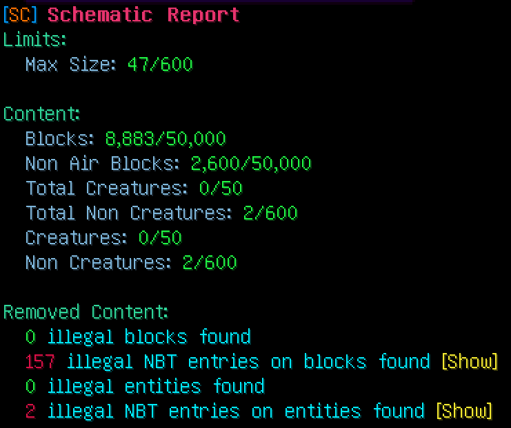

# Schematic Sanitizer

The schematic sanitizer can check and filter schematics.
This can be done by an extensive config which allows to blacklist entities, blocks and even specific nbt tags and values contained in those tags.

The sanitizer can give you a report of found issues on the schematic or even fix them right away and output a new file.

This plugin can be used as a standalone plugin or as an api.

## Usage as a plugin

Use `/schematicsanitizer` to get into the plugin.

### Checking a schematic

Use `/schematicsanitizer check <schematic name>` to get a report of a specific schematic.

The report will contain a list of removed entities and block and also list their removal cause.



### Fixing a schematic

Instead of just checking you can use `/schematicsanitizer fix <schematic name> [new name]`, which will perform the check and write the cleaned schematic into a file.

If you leave the new name empty a new file suffixed with `_new` will be created.

If you add the -o flag at the end you will override the original file.

The schematic sanitizer will do the following:

- Remove blocks which are blacklisted
- Remove entities that are blacklisted
- Remove blocks which contain blacklisted nbt data
- Remove entities that contain blacklisted nbt data
- Remove every creature once the limit is reached
- Remove every non creature once the limit is reached

What it won't do:

- Change the size of the schematic in any way
- Remove any blocks once the limit is exceeded

### Batch processing

Instead of just fixing a single schematic you can fix a whole directory with `/schematicsanitizer fixbatch <directory>`.

This will fix all schematics directly inside this directory. Schematics will be saved suffixed with `_new`.
Adding the `-o` flag will override the original files.

You will receive a short report of every single schematic telling you the problems if there were some.

## Usage as an api

```kts

```

Get the path of your schematic
```java
Path schematic = getDataFolder().toPath().resolve("myschematic.schem");
```

Create your settings

```java
Settings settings = Settings.builder()
        .filter(filter -> filter
                .blockFilter(blocks -> blocks.withMaterialBlacklist(Material.COMMAND_BLOCK)
                .entityFilter(entities -> entities
                        .removeCreature(true)
                        .withEntityBlacklist(EntityTypes.COMMAND_BLOCK_MINECART)
                .withTextBlacklist("clickEvent","run_command")
                .withNbtBlacklist("Item","Items"))
        .limit(limit -> limit
                .size(600)
                .contentLimit(c -> c.blocks(50000).creatures(50).nonCreatures(600)))
        .build();
```
<details>
<summary>Full Settings example</summary>

```java
Settings settings = Settings.builder()
        .filter(filter -> filter
                .blockFilter(blocks -> blocks
                        .withMaterialBlacklist(
                                Material.COMMAND_BLOCK,
                                Material.REPEATING_COMMAND_BLOCK,
                                Material.CHAIN_COMMAND_BLOCK,
                                Material.STRUCTURE_BLOCK)
                )
                .entityFilter(entities -> entities
                        .removeCreature(true)
                        .removeNonCreatures(false)
                        .withEntityBlacklist(
                                EntityTypes.COMMAND_BLOCK_MINECART,
                                EntityTypes.FALLING_BLOCK,
                                EntityTypes.POTION)
                )
                .withTextBlacklist(
                        "clickEvent",
                        "run_command"
                )
                .withNbtBlacklist(
                        "LootTable",
                        "ArmorItem",
                        "ArmorItems",
                        "HandItem",
                        "HandItems",
                        "FireworksItem",
                        "Item",
                        "Items",
                        "DecorItem",
                        "Inventory",
                        "buy",
                        "buyB",
                        "sell",
                        "SaddleItem"
                )
        )
        .limit(limit -> limit
                .size(600)
                .contentLimit(content -> content
                        .blocks(50000)
                        .creatures(50)
                        .nonCreatures(600)
                )
        )
        .build();
```
</details>

Create a Sanitizer instance

```java
Sanitizer sanitizer = Sanitizer.create(schematic, settings);
```

Perform a check and evaluate the report

```java
SanitizerReport check = sanitizer.check();

getLogger().info("Removed %d blocks".formatted(check.blocks().size()));

for (RemovedBlock entity : check.blocks().entities()) {
    getLogger().info("Removed block %s at %s caused by %s".formatted(entity.type(), entity.location(), entity.removalCause()));
}

getLogger().info("Removed %d entities".formatted(check.entities().size()));

for (RemovedEntity entity : check.entities().entities()) {
    getLogger().info("Removed entity %s at %s caused by %s".formatted(entity.type(), entity.location(), entity.removalCause()));
}
```

Alternatively you can perform a fix of the schematic

```java
SanitizerReport fix = sanitizer.fix(Path.of("path", "to", "new", "file.schematic"));
```

Instead of providing a path you can also just provide a new name and the new schematic will be created next to the old one.
If you provide no name the original schematic will be overridden. 
